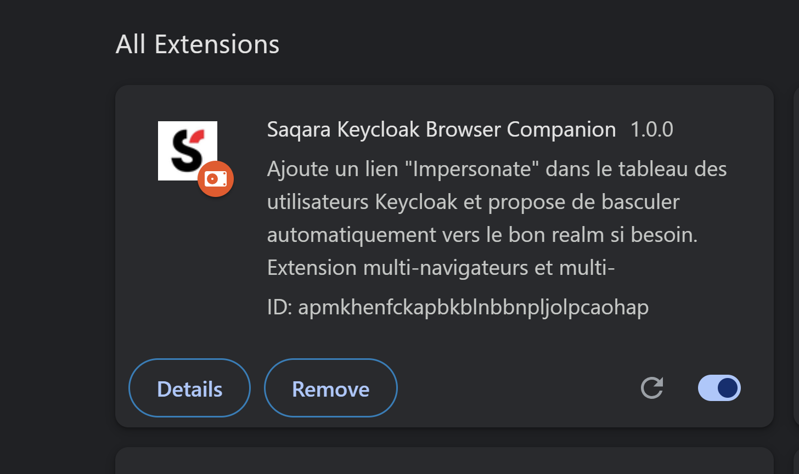
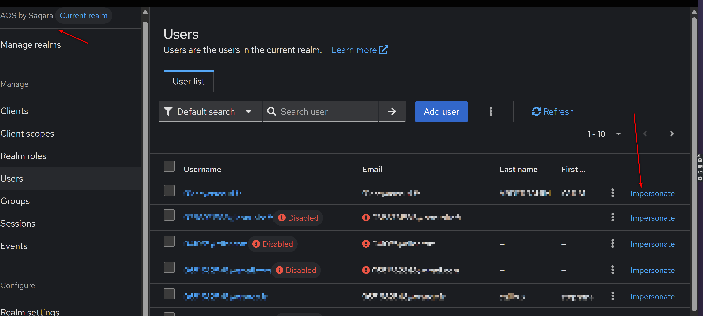
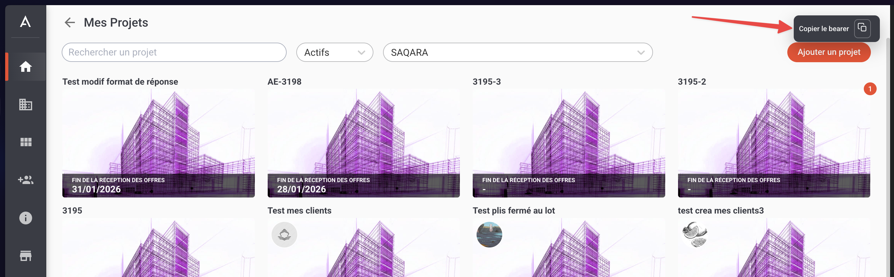

# Saqara Browser Companion

## Overview

**Saqara Browser Companion** is a Chrome and Firefox extension that :

- Enhances the Keycloak admin UI for administrators and support teams. It was created in response to the upgrade from Keycloak 16 to Keycloak 25, which removed the original "Impersonate" button from the users table. This extension restores and improves that functionality, making user impersonation easy and accessible again. It also suggests realm switching when relevant and supports multiple Keycloak environments.
- Enables one-click Bearer token copying from the AOS interface for easier API testing and integration.

The extension is easy to install manually and requires no developer skills.

## Features

- **One-click user impersonation**: Instantly impersonate any user directly from the users table, and injects an "Impersonate" button next to the user details page header.
- **Automatic realm switch suggestion**: If only two realms are available and you are on the default realm (usually "master"), the extension offers to switch to the other realm for a smoother admin experience.
- **Multi-environment support**: Works on all Keycloak admin URLs and AOS environments.
- **Bearer token copy button**: Adds a convenient button to copy the Bearer token from the AOS interface for easy API testing.
- **Works on Chrome and Firefox**: Compatible with Manifest v3 and tested on both browsers.
- **No sensitive data stored**: The extension does not store or transmit any personal or sensitive data.

## Installation

### Chrome

> **Note:** This extension should work on any Chrome-based browser such as Arc, Edge, Brave, etc.

1. Clone or [download this repository](https://github.com/saqara/keycloak-browser-companion/archive/refs/heads/main.zip).
2. Unzip the downloaded file if necessary.
3. Open Chrome and go to [`chrome://extensions/`](chrome://extensions/).
4. Enable Developer mode (top right corner).
5. Click "Load unpacked"/"Charger une extension non empaquetée" and select the `src` folder.
6. The extension icon should appear in the Chrome toolbar.

### Firefox

1. Clone or [download this repository](https://github.com/saqara/keycloak-browser-companion/archive/refs/heads/main.zip).
2. Unzip the downloaded file if necessary.
3. Open Firefox and go to [`about:debugging#/runtime/this-firefox`](about:debugging#/runtime/this-firefox).
4. Click "Load Temporary Add-on"/"Charger un module complémentaire temporaire".
5. Select the `manifest.json` file inside the `src` folder.
6. The extension icon should appear in the Firefox toolbar.

> **Note:** For permanent installation on Firefox, the extension must be published on the Firefox Add-ons Store. This guide covers manual installation for development and internal use.

## Usage

- Navigate to a supported Keycloak admin interface.
- The "Impersonate" link will appear in each user row of the users table.
- Click "Impersonate" to instantly impersonate that user.
- If you are on the default realm and only one other realm exists, a popup will offer to switch realms automatically.

### Supported Keycloak URLs

| Environment   | URL                                           |
|---------------|-----------------------------------------------|
| Development   | <http://keycloak:10000/>                      |
| Staging       | <https://account.staging.saqara.com/>         |
| Preproduction | <https://account.preproduction.saqara.com/>   |
| Demo          | <https://account.demo.go-aos.io/>             |
| Production    | <https://account.go-aos.io/>                  |

### Supported AOS URLs

| Environment   | URL                                           |
|---------------|-----------------------------------------------|
| Staging       | <https://app.staging.saqara.com/>             |
| Preproduction | <https://app.preproduction.saqara.com/>       |
| Production    | <https://app.saqara.com/>                     |

## Troubleshooting

- If the extension icon does not appear or features do not work, check the browser console (F12) for errors.
- Ensure you are using a supported version of Chrome or Firefox (Firefox 109+ required for Manifest v3).

## Notes for Developers

- The extension is built using Manifest v3, which is the latest standard for Chrome extensions.
- This extension does not require any backend server or API; it operates entirely within the browser.
- You can modify the source files in the `src` directory. Before pushing changes, run the linter to ensure code quality:

  > **Warning:** If you forget to run the linter, the CI will catch you faster than you can say `npm run lint`! 🚨
